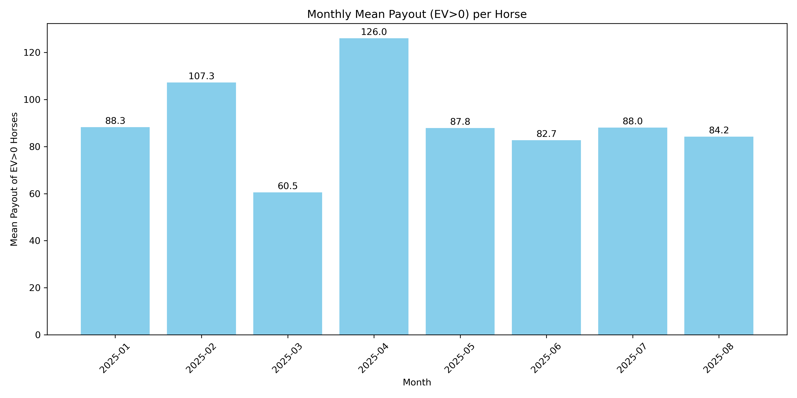

# 競馬勝率予測プロジェクト

## 概要

本プロジェクトでは、**LightGBM** を用いて競走馬のレースに勝つ確率を予測し、理論上利益が見込める馬（EV > 0）を特定することを目的としています。  
過去のJRDBデータを用いて、特徴量作成・モデル学習・ハイパーパラメータチューニング・評価を行っています。

## コード

メインコードはノートブック [`jrdb_prediction.ipynb`](jrdb_prediction.ipynb) にあります。

## 方法

1. **勝率予測**  
   - LightGBMモデルを用いて、各馬の勝つ確率(`win_prob`)を予測します。
   - モードは `rank`、`binary`、`multiclass` の3種類があります。

2. **期待値（EV）の計算**  
   - 各馬のEVは次の式で計算されます：
     ```
     EV = odds * win_prob - 1
     ```
   - **EV > 0** の馬のみが理論上利益が見込める馬として判断されます。

3. **Optunaによるハイパーパラメータチューニング**  
   - 時系列順に分割したK-Foldを使用し、データリークを防ぎます。  
   - 検証・テストデータは常に**学習データの未来**となるように設定。  
   - チューニングの目的は、**EV > 0の馬の配当平均を最大化**することです。

4. **評価**
   - 最終モデルは **2025年データ** でテストし、学習には **2024年までのデータ** のみを使用。  
   - 評価指標は、EV > 0 の馬の **平均単勝配当** です。

## 結果

- 2025年データにおける EV > 0 馬の平均単勝配当は **90** となりました。  
- 平均配当100以上を狙う理論的利益にはまだ届かず、**過学習の傾向**が残っていることが示唆されます。  
- 月ごとの結果は変動が大きく、ヒストグラムで確認できます。



## 今後

- 本分析で使用するオッズは**投票締切15分前のもの**であり、最終オッズとは異なる場合があります。  
- 過学習を抑えるため、K-Fold数の増加や追加特徴量の検討、異なるモデルの検証が今後の改善策となります。
- データセットのノイズを抑えるために、レース内での不利などを考慮
